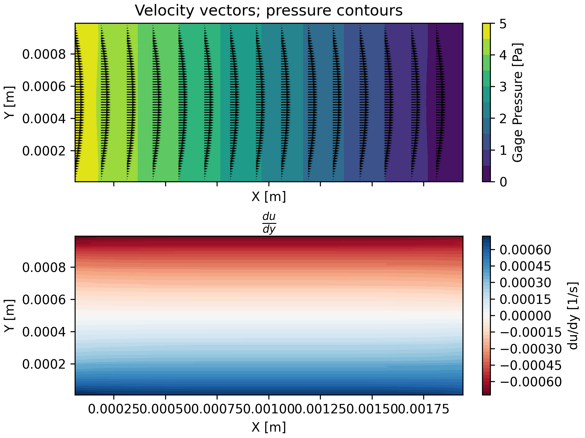

# <ins>O</ins>pen <ins>R</ins>ust <ins>C</ins>FD

Are you tired of Fluent crashing (I thought so!) and you don't care about
features or performance (ok, maybe not)? ORC is a simple finite volume CFD
solver implemented in Rust with minimal dependencies. ORC supports arbitrary
unstructured grids with any of the following cell types:
- Supported cell types:
  - Tetrahedron (4 faces, 4 nodes)
  - Pyramid (5 faces, 5 nodes)
  - Wedge (5 faces, 6 nodes)
  - Hexahedron (6 faces, 8 nodes)
  - Polyhedron (M faces, N nodes)
Technical details:
- Co-located grid
- SIMPLE pressure-velocity coupling (coupled solver may be added)
- Momentum discretization: upwind differencing and central differencing
- Gradient reconstruction: Green-Gauss cell-based (least squares may be added)
- Linear pressure interpolation
- Linear velocity interpolation (Rhie-Chow will be added to mitigate checkerboarding)
- Supported boundary conditions:
  - Wall
  - Pressure outlet
  - Pressure inlet
  - Velocity inlet
  - Symmetry (not added yet)

**Alpha state** with major functionality still in the works. Stability is lacking, but per the
header image ORC can produce a roughly parabolic laminar velocity profile in Couette flow. Multigrid
is desperately needed.

Roadmap:
- [X] Read TGRID (ANSYS Fluent) mesh into memory
- [X] Build solution matrices
- [ ] Initialize flow (30% complete)
- [X] Iterate steady
- [X] Add under-relaxation
- [ ] Implement Rhie-Chow interpolation (90% complete; added but not verified)
- [ ] Add cross diffusion correction
- [ ] Multigrid
- [ ] Read/write solution data (20% complete)
- [ ] Read/write settings?
- [ ] CLI
- [ ] Iterate transient
- [ ] Standard k-epsilon turbulence model?
- [ ] Add other mesh formats?
- [ ] Add validation of canonical flows
