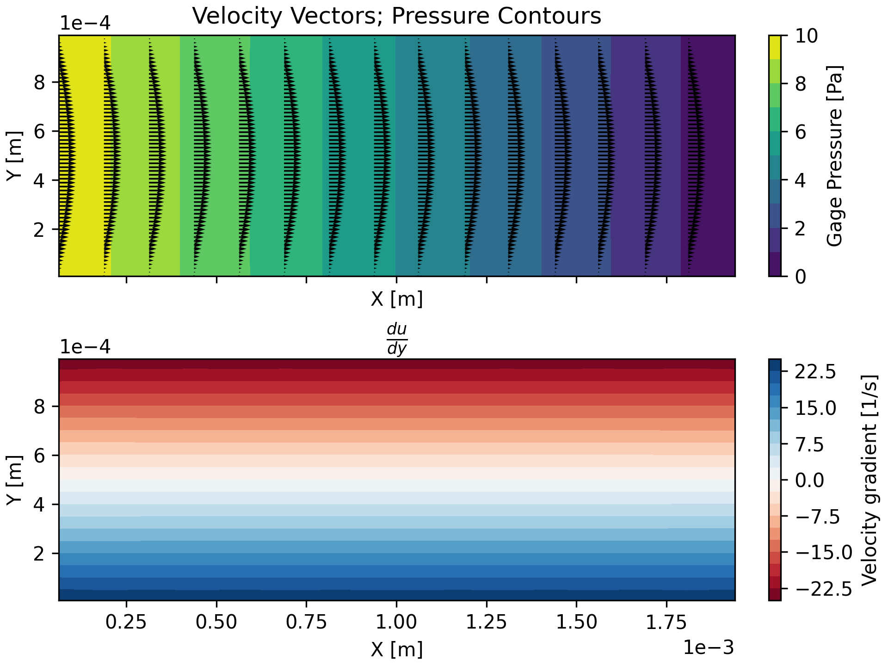
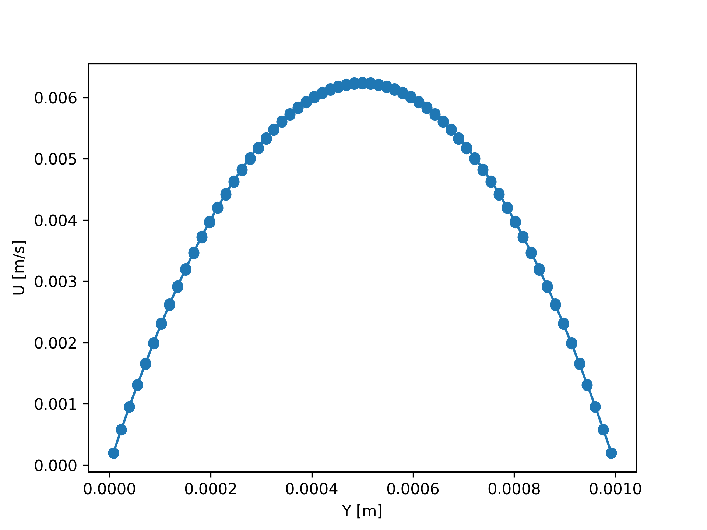

# <ins>O</ins>pen <ins>R</ins>ust <ins>C</ins>FD: A 3D, unstructured computational fluid dynamics (CFD) solver

Are you tired of Fluent crashing (I thought so!) and you don't care about
features or performance (ok, maybe not)? ORC is a simple finite volume CFD
solver implemented in Rust with minimal dependencies. ORC supports arbitrary
unstructured grids with the following numerical schemes and details:
- Co-located grid
- Algebraic multigrid solver with BiCGSTAB, Jacobi, or Gauss-Seidel smoothing (GMRES will be evaluated)
- Pressure-velocity coupling: SIMPLE (coupled solver may be added later)
- Momentum discretization: UD, CD, LUD, QUICK (bounded higher-order schemes will be added)
- Gradient reconstruction: Green-Gauss cell-based (least squares may be added)
- Pressure interpolation: linear and second-order
- Velocity interpolation: linear and Rhie-Chow distance-based

**Alpha state** with major stability issues. Pressure relaxation factor must be very
small to converge to the correct solution. As the pressure relaxation factor
increases, the solution fields become extremely spurious. 

Supported cell types:
- Tetrahedron (4 faces, 4 nodes)
- Pyramid (5 faces, 5 nodes)
- Wedge (5 faces, 6 nodes)
- Hexahedron (6 faces, 8 nodes)
- Polyhedron (M faces, N nodes)

Supported boundary conditions:
- Wall
- Pressure outlet
- Pressure inlet
- ~~Velocity inlet~~ (unfinished)
- Symmetry

Roadmap:
- [X] Read TGRID (ANSYS Fluent) mesh into memory
- [X] Build solution matrices
- [ ] Initialize flow (90% complete)
- [X] Iterate steady
- [X] Add under-relaxation
- [X] Implement Rhie-Chow interpolation (very unstable for now)
- [X] Improve Rhie-Chow stability or use another scheme
- [ ] Fix velocity inlet BC
- [ ] Add moving wall BC
- [ ] Implement bounded high-order momentum schemes, e.g. Jasak et al.'s bounded central differencing
- [ ] Add cross diffusion correction
- [X] Multigrid
- [X] Read/write solution data
- [ ] Read/write settings?
- [ ] Replace panics with proper error handling
- [ ] CLI
- [ ] Iterate transient
- [ ] Standard k-epsilon turbulence model?
- [ ] Add other mesh formats?
- [ ] Add validation of canonical flows
- [ ] Optimize performance (20%; preliminary profiling and adjustment has been done)
- [ ] Polish logging - ideally write error/warn/info to console and everything to file, all depending on RUST_LOG env var

Validation:
Only very preliminary validation has been performed. As seen below, the
velocity profile for steady, pressure-driven channel flow exactly matches the
analytical profile.

